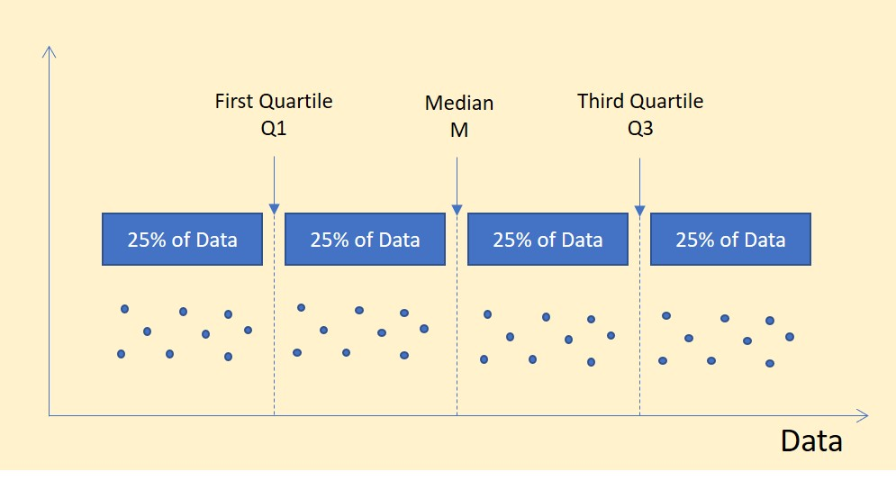
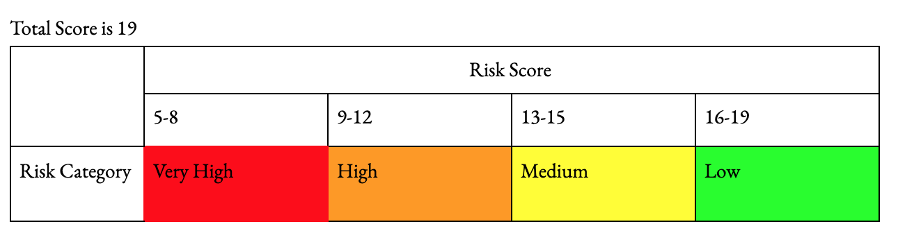
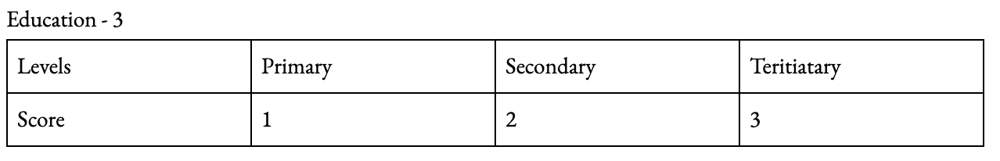
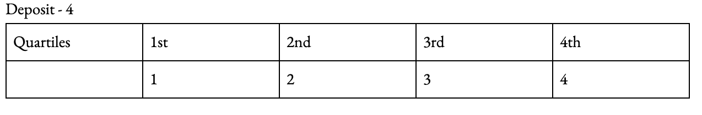
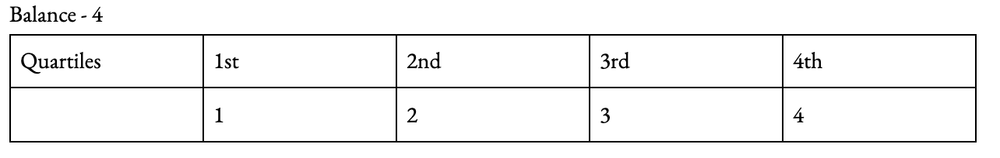
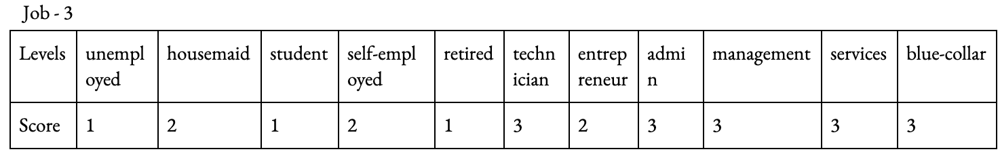
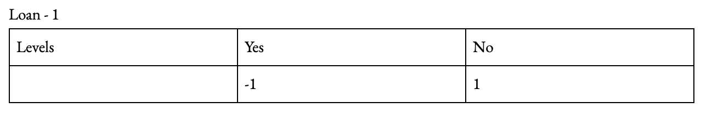
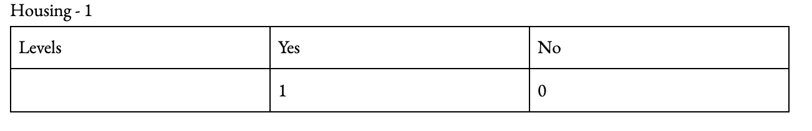
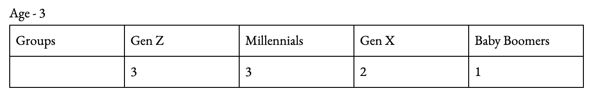

```{r setup, include=FALSE}
knitr::opts_chunk$set(echo = TRUE)
options(scipen = 9999)
options(width = 75)
knitr::opts_chunk$set(linewidth = 75)
library(knitr)
library(formatR)
library(ggplot2)
library(xts)
library(tidyquant)
opts_chunk$set(tidy.opts=list(width.cutoff=75),tidy=TRUE)
mode <- function(v, empty = FALSE) {
  if(empty){
    v = v[v != ""]
  }
  uniqv <- unique(v)
  uniqv[which.max(tabulate(match(v, uniqv)))]
}

antimode <- function(v, empty = FALSE) {
  if(empty){
    v = v[v != ""]
  }
  uniqv <- unique(v)
  uniqv[which.min(tabulate(match(v, uniqv)))]
}

```
# Outline

## Outline
- Background 
- Terms & Language
- Data Cleaning & Observation
- Data Transformation
- Data Analysis

# Background 

## Background 

### Problem:
In light of the Covid-19 Pandemic, BankN has notable reductions in transactions, deposits, and commitments to a number of their financial products.

They require QualityAssured to perform complex analysis of their customers from pre-pandemic data to allow for: 

- meaningful insights to aid in decision making 
- effective lead generation and customer commitment to their financial products. 


# Terms & Language 
## Terms & Language 
### Outlier
An outlier refers to 


# Data Cleaning & Observations

## Question 1
1. Load the dataset and explore the contents, summarizing your findings of the data quality in
relation to standard measures (including, mean, median, standard deviation, missing values,
outliers, etc.). Review the data dictionary attached to get the context of each measurement.

    a.Describe the data in terms of the types and measurements and what each measurement
represents (purpose of features, range of values, min, max, etc.)

    b.Fix missing values, noise and outliers as necessary
    
```{r echo=FALSE}
bankn <- read.csv("2021-Set03-QualityAssured.csv", 
                  header = T, sep = ",", stringsAsFactors = T)
```

# Summary of Data 

## Summary of Data | RefNum
- A unique identifier for each customer
```{r}
summary(bankn$RefNum)
```
As seen above the values range from 10023467 to 10024584, which accurately
reflects that there are 1118 records. These Reference numbers may be needed later on.
There does not appear to be any outliers or missing values.

## Summary of Data | Age

- numeric age of the customer
```{r}
summary(bankn$age)
```
- Std. Deviation (returns NA because of missing values)

`r sd(bankn$age)`
- There appears to be no unusual ages present, however, there are missing values. 
We have chosen to replace them with the median age.

## Fixing the missing values in age
```{r}
bankn$age[is.na(bankn$age)] <- median(bankn$age, na.rm = T)
summary(bankn$age)
```

## Summary of Data | Marital Status

- Marital status ("married","divorced","single"; note: "divorced" means divorced or widowed)

```{r}
summary(bankn$marital)
```
Nothing appears to be extraordinary in the marital status field.

## Summary of Data | Job

Types of Job ("admin.", "unemployed", "management","housemaid", "entrepreneur", "student", "blue-collar","self-employed", "retired", "technician", "services")

```{r}
summary(bankn$job)
```
- According to the data dictionary, there should be only 11 levels,
but there is one extra level. A " " character. There are 5 records with the job.

----

- After considering whether the values could be corrected. 4 of the 5 records also had no education level attached, which was the metric to be used to fill the missing education values.

## Job's Missing Values
```{r}
bankn[!(bankn$job %in% c("admin.", "unemployed", "management","housemaid", "entrepreneur", "student", "blue-collar","self-employed", "retired", "technician", "services")),2:5]
```
- Thus, It was determined that no other metric was reliable. The record containing the education level was filled with the most prevalent job and the other 4 removed from the data set.

## Code to remove values

```{r}
bankn <- bankn[(bankn$job %in% c("admin.", "unemployed", "management","housemaid", "entrepreneur", "student", "blue-collar","self-employed", "retired", "technician", "services")) | (bankn$education %in% 
                    c('tertiary','secondary','primary')),]
summary(bankn$job)
```

## Record with Educational Level but Missing Job (Before)
```{r}
before <- bankn[!(bankn$job %in% c("admin.", "unemployed", "management","housemaid", "entrepreneur", "student", "blue-collar","self-employed", "retired", "technician", "services")),]
before
refnum <- before$RefNum
```

## Correcting the Missing Job with an Education Value

```{r}
bankn[!(bankn$job %in% c("admin.", "unemployed", "management","housemaid", "entrepreneur", "student", "blue-collar","self-employed", "retired", "technician", "services")),"job"] <- mode(bankn$job[bankn$education == "primary"])
```

## Record with Educational Level but Missing Job (After)
```{r}
bankn[bankn$RefNum == refnum,]
```

## Summary of Data | Education

- ("secondary","primary","tertiary")
```{r}
summary(bankn$education)
```
For the education level, we have 94 empty values and 2 "?" characters that we
believe may represent an unknown value. To replace these values, we have 
decided it best to replace the missing values based on job. Certain types 
of jobs dominate certain education levels as seen here:.

# Education Distribution by Job

----

```{r, fig.cap="Fig.3 Primary education dist. by Jobs", fig.align = 'center'}
ggplot(bankn[bankn$education == "tertiary",c(3,5)], aes(x="", y=job, fill=job)) +
  geom_bar(stat="identity", width=1) +coord_polar("y", start=0) +theme_void()
```

----

```{r, fig.cap="Fig.3 Primary education dist. by Jobs", fig.align = 'center'}
ggplot(bankn[bankn$education=="secondary",c(3,5)], aes(x="", y=job, fill=job)) +
  geom_bar(stat="identity", width=1) +coord_polar("y", start=0) + theme_void()
```

----

```{r, fig.cap="Fig.3 Primary education dist. by Jobs", fig.align = 'center'}
ggplot(bankn[bankn$education == "primary",c(3,5)], aes(x="", y=job, fill=job)) +
  geom_bar(stat="identity", width=1) +coord_polar("y", start=0) + theme_void()
```


## Analysis
With this information we can assign an education level to match the prevalence 
of that job at that level.

## Helping Functions | geteducation
- This function allows us to get the most prevalent education level for a job

```{r}
geteducation <- function(jobs){
  lis <- vector()
  for (job in jobs) {
    tert <- length(bankn$education[bankn$education == "tertiary" & bankn$job == job])
    sec <- length(bankn$education[bankn$education == "secondary" & bankn$job == job])
    prim <- length(bankn$education[bankn$education == "primary" & bankn$job == job])
    len = nrow(bankn[bankn$job == job,])
    lis <- append(lis, ifelse(tert > sec & tert > prim, "tertiary", ifelse(sec > tert & sec > prim,
           "secondary", ifelse(prim > tert & prim > sec,
           "primary", '?'))))
  }
  return(lis)
}
```

## Helping Function | getEducationRatio
- This function allows us to get the percentiles for distribution of jobs by
education levels.

```{r}
getEducationRatio <- function(jobs){
    lis <- list()
    df <- data.frame()
    for (job in jobs) {
      tert <- length(bankn$education[bankn$education == "tertiary" & bankn$job == job])
      sec <- length(bankn$education[bankn$education == "secondary" & bankn$job == job])
      prim <- length(bankn$education[bankn$education == "primary" & bankn$job == job])
      len = nrow(bankn[bankn$job == job,])
      tertiary = round((tert/len)*100, digits = 2)
      secondary = round((sec/len)*100, digits = 2)
      primary = round((prim/len)*100, digits =2)
      lis <- append(lis, data.frame(c(tertiary,secondary,primary)))
    }
    return(do.call(rbind, lis))
}
```

## Fixing Errors/Unknown Values

```{r}
missingEducation <- bankn[!(bankn$education %in% c('tertiary','secondary','primary')), c('job','education')]
vals <- geteducation(missingEducation$job)
bankn$education[!(bankn$education %in% c('tertiary','secondary','primary'))] <- vals
```

```{r}
summary(bankn$education)
```

## Justifying Using the Most Prevalent Job

We can see by using ratios that most jobs are disproportionately associated with certain
education levels

## Code for Values
```{r}
jobs <- getEducationRatio(c("admin.", "unemployed", "management","housemaid", "entrepreneur", "student", "blue-collar","self-employed", "retired", "technician", "services"))
colnames(jobs) <- c("tertiary","secondary","primary")
rownames(jobs) <- c("admin.", "unemployed", "management","housemaid", "entrepreneur", "student", "blue-collar","self-employed", "retired", "technician", "services")
```

## Jobs with Educational Level
```{r}
jobs
```


## Summary of Data | Housing

```{r}
summary(bankn$housing)
```
- The housing data is categorical, so no standard values were obtained from it, it simply gave a count of yes or no. There were also no outlier or missing values.

## Summary of Data | Loan

- Does this person have a personal loan?
```{r}
summary(bankn$loan)
levels(bankn$loan)
```

## Summary of Data | Loan

- The loan data is representing a Boolean if the user has a loan or not
- It is represented as categorical measurement with values "yes" or "no"
- There are 15 missing values that are read as a blank field in the dataframe.
- This data column has good data as 1103 of the field data value is filled

## Summary of Data | Loan

The loan categorical measurement have 15 missing values. These missing values 
can be removed or it can be replaced. The option to replace the values were 
considered. 
Normally, to get a loan the applicants, job, finances, age, credit  and other loans are normally considered in a financial institution. However, the dataset shows the value for loans being empty. The option to use the jobs, age, education
and mortgage was considered to decide if a user has a loan or not. However, although a model can dictate the possibility of someone being given a loan. It is
not 100% correct that the person had a loan.Therefore, to solve the issue the
empty values for the loans were set to no. It was assumed that an empty value 
is a representation of the user being skipped due to them not having a loan. 


- The spaces set to "no"
```{r}
bankn[bankn$loan == "", "loan"] <- "no"
```


## Summary of Data | Contact
```{r}
summary(bankn$contact)
```
- The contact column is empty and has no value. It cannot be used in analysis.
- The column would be removed as it would not be used.

- contacts column removal
```{r}
bankn$contact <- NULL
```


## Summary of Data | Day

```{r}
summary(bankn$day)
```
- The standard values obtained from the date were not exactly meaningful, as they do represent ordinal values for the days in a month. However when day was analyzed with the month and potential year of the data set, it was observed that there may be outlier for the month of February where the day was 29. This is possible if the year of the data set was 2019, since that was not a leap year. A definite outlier would have been where the day was 30 for the month of February. 

## Summary of Data | Month

```{r} 
summary(bankn$month)
```
* Outlier : Since the data set is categorical in nature and using the summary of the month column we can conclude that there are no outliers for this data set None 

* the month feature is used to describe the months of the year which the last deposite was made and as a result is a categorical data type

* Value Range : The possible values that can be taken on by month ranges between "january" to "december"

* Min : This is initially meaningless when used against categorical data but it when used with the summary function , which will returns total number of times the each category appears within the dataset min can be used to determine the lowest number of times a category appears 

## Summary of Data | Month

```{r}
min(summary(bankn$month))
```
* Max : This is initially meaningless when used against categorical data but it when used with the summary function , which will returns total number of times the each category appears within the dataset, min can be used to determine the highest number of times a category appears

```{r}
max(summary(bankn$month))
```
missing values : 

```{r}
sum(is.na(bankn$month))
```

## Summary of Data | Month

####  Fixing Errors/Unknown Values
```{r}
onlyFebDates <- bankn[bankn$month=="february" & bankn$day>28,]
onlyFebDates$day <- onlyFebDates$day-28 
onlyFebDates$month <- "march"
bankn[bankn$month=="february" & bankn$day>28,] <- onlyFebDates
```

## Summary of Data | Duration

```{r}
summary(bankn$duration)
```
- Std. Deviation
`r sd(bankn$duration)`

Data Type: Since the Duration data type is a measure of the length of time spent on a call (seconds) then this factor does possess a true Zero placing it as a Ratio Data type 

Range of value: the values present range from 2 to 2177 (seconds)

## Summary of Data | Duration

min: using the "min" function we can find the value with the shortest call duration 
```{r}
min(bankn$duration)
```

## Summary of Data | Duration

max: using the "max" function we can find the value with the longest call duration 
```{r}
max(bankn$duration)
```
missing values: From the summary of the vector we can see that there are no missing values present in the vector

noise: When looking at the structure of the data set we see that the "duration" factor consists of purely integers

outliers: With the use of a box plot we can see if any outliers exist

## Summary of Data | Duration

```{r}
boxplot(bankn$duration)
```

From the result of the box plot we can see there are many outliers but with the nature or the feature in question these outliers can be considered valid data as the length of time a person would be willing to stay on the phone may vary 


## Summary of Data | Deposit

#### Fixing Missing Values in Deposit. 
There are 152 missing values missing within the data. In order to fix them, central tendency is used.Specifically, the mean is used because the data is skewed.The missing values will be replaced with the median for individual's who are grouped by the job feature.
```{r}
head(bankn[is.na(bankn$deposit),],n = 10)
```
```{r}
bankn[(bankn$deposit==0),]
```

## Summary of Data | Deposit

#### Fixing the missing values and noise
```{r}
median_list <- aggregate(bankn$deposit, by=list(bankn$job), FUN=median, na.rm = TRUE)

missing_deposits <- bankn[is.na(bankn$deposit) | bankn$deposit==0,]

for (i in 1:nrow(missing_deposits)){
  missing_deposits[i,'deposit'] <- median_list[median_list$Group.1 == (missing_deposits[i,'job']),'x']
}
bankn[is.na(bankn$deposit) | bankn$deposit==0,] <- missing_deposits
```

## Summary of Data | Deposit

####  Removing outliers
```{r}
sd_deposit <- sd(bankn$deposit)
mean_deposit <- mean(bankn$deposit)
upper_limit <- mean_deposit + (2*sd_deposit)
lower_limit <- mean_deposit - (2*sd_deposit)

bankn$deposit[bankn$deposit > upper_limit] <- upper_limit
bankn$deposit[bankn$deposit < lower_limit] <- lower_limit

```

## Summary of Data | Deposit
The deposit feature stores the amount of money deposited by a customer during their last transaction.A box plot revealed that there are several outliers within this feature. The values are  majority numeric. The measurement type is ratio since there are absolute zeros present. There are also several missing values of type NA.

----
```{r, fig.align='center', fig.cap='Boxplot of Deposits'}
boxplot(bankn$deposit)
```

----
```{r, fig.align='center', fig.cap='Density Plot of Deposits'}
hist(bankn$deposit, prob = TRUE, main = "Density of Bank Deposits",ylim=c(0,.0001), xlim=c(0,80000))
lines(density(bankn$deposit), lwd = 1, col = "blue")
```

## Summary of Data | Deposit

```{r}
summary(bankn$deposit)
```
----

```{r, fig.align='center', fig.cap='Histogram of Deposits'}
hist(bankn$deposit, prob = TRUE, main = "Density of Bank Deposits",ylim=c(0,.0001), xlim=c(0,80000))
lines(density(bankn$deposit), lwd = 1, col = "blue")
```

## Summary of Data | Balance

```{r}
summary(bankn$balance, maxsum = 10)
```

- Std. Deviation won't work because of characters. Thats why the data type is factor and not numeric

`r #sd(bankn$balance)`
- The balance field contains 4 rows with characters instead of numeric 
  at row 8, 54, 26 and 87. Which causes the field to be interpreted as a factor field.

## Summary of Data | Balance

####  Values  
```{r echo=TRUE}
bankn$balance[c(8, 54, 26, 87)]
```

## Summary of Data | Balance

#### Removing noise 

In order to convert the balance feature to a numeric type instead of a factor type we make use of the as.numeric and as.character functions
```{r}
bankn$balance <- as.numeric(as.character(bankn$balance))
```

## Summary of Data | Balance

#### Replacing Errors

```{r}
balance_na_jobs <- unique(bankn[is.na(bankn$balance),3])

median_list <- aggregate(bankn$deposit, by=list(bankn$job), FUN=median, na.rm = TRUE)

median_list <- median_list[c(which(median_list[,1] %in% balance_na_jobs)),]

bankn_missing_balance <- bankn[is.na(bankn$balance),]

for(i in 1:nrow(bankn_missing_balance)){
  bankn_missing_balance[i,'balance'] <- median_list[median_list$Group.1 == (bankn_missing_balance[i,'job']),'x']
}
bankn[is.na(bankn$balance),] = bankn_missing_balance
```

## Summary of Data | Balance

#### Fixing outliers

```{r}
sd_balance <- sd(bankn$balance)
mean_balance <- mean(bankn$balance)
upper_limit <- mean_balance + (2*sd_balance)
lower_limit <- mean_balance - (2*sd_balance)

bankn$balance[bankn$balance > upper_limit] <- upper_limit
bankn$balance[bankn$balance < lower_limit] <- lower_limit
```
----

```{r, fig.align='center', fig.cap='Boxplot of Balance'}
boxplot(bankn$balance)
```
----
```{r, fig.align='center', fig.cap='Density Plot of Balance'}
hist(bankn$balance, prob = TRUE, main = "Density of Bank Balance",ylim=c(0,.000012), xlim =c(-200000,1200000))
lines(density(bankn$balance), lwd = 1, col = "blue")
```


## Structure of the data
```{r echo=FALSE}
str(bankn)
```
# Data Transformation | Question 2-6

# Question 2

## Question 2 | Convert the duration from the current value in seconds to minutes.

#### Before
```{r}
head(bankn$duration, n = 3)
bankn$duration <- round(bankn$duration/60, digits = 2)
```

#### After
```{r}
head(bankn$duration, n = 3)
```

# Question 3


## Question 3 | Apply one of the binning methods discussed to discretize age. Justify your selection and apply the changes to make age a categorical variable (factor in R).

----

```{r, fig.cap="Distribution of Ages", fig.align='center'}
hist(bankn$age, col="lightgreen", col.lab="darkgrey",
     col.axis="darkgrey", xlab = "Age", main="")
```

## Discretization Method | Generation Groups

### Justification

1. Ages do not contain outliers.

2. We could have meaningful categories to represent different generations of bankers.

3. Well-researched categories can provide meaningful insights into views on money.

4. Standard Discretization methods would not offer as much insights as this method.

## Categories Selected

- Generation Z (1996 – 2015, age <=25)
- Millennial (1977 – 1995, age 26 <=44)
- Generation X (1965 – 1976, age 45 <= 56)
- Baby Boomers (1946 – 1964, age 57 <= 75)


```{r}
age.max = max(bankn$age)
age.min = min(bankn$age)
new.max = age.max + 1
age.temp <- cut(bankn$age, breaks = c(age.min - 1, 23, 44, 56, age.max),
                labels = c("Gen Z", "Millennials", "Gen X", "Baby Boomers"), right = TRUE)
# data.frame(old = bankn$age, new = age.temp) 
bankn$age <- age.temp
```

## Discretization | New Values

```{r}
head(bankn$age, n = 5)
```

# Question 4

## Question 4 | Apply one of the normalization methods discussed to any feature in the dataset. Justify your decision.

### Min-Max normalization
```{r}
d_min <- min(bankn$deposit)
d_max <- max(bankn$deposit)
summary(bankn$deposit)
```

----
```{r, fig.align='center', fig.cap='Density Plot of Deposits Before Norm'}
hist(bankn$deposit, prob = TRUE, main = "Density of Bank Deposits",ylim=c(0,.0001), xlim=c(0,80000))
lines(density(bankn$deposit), lwd = 1, col = "blue")
```

```{r}
d_norm <- ((bankn[,"deposit"]- d_min) / (d_max - d_min))*((40-1) +1)
bankn$deposit <- round(d_norm, digits = 3)
summary(bankn$deposit)
```

----
```{r, fig.align='center', fig.cap='Density Plot of Deposits After Norm'}
hist(bankn$deposit, prob = TRUE, main = "Density of Bank Deposits",ylim=c(0,.2), xlim=c(0,45))
lines(density(bankn$deposit), lwd = 1, col = "blue")
```

# Question 5

## Question 5 | Construct a new column (variable) called <strong>last_deposit</strong> which records the number of days since the client made a deposit. Use the month and day columns and calculate this value with the current date.

## Question 5 | What was done?

1. We converted the day and month fields into Date objects.
2. We noticed that there were dates in the future.
3. We set back dates in the future by one year.
4. Subtracted those dates from the current date to get the number of days between them.

```{r}
temp <- as.Date(paste(bankn$day,bankn$month,"2019",sep = " "), format = "%d %B %Y")
head(temp)
bankn$last_deposit <- Sys.Date() - temp
```

## Question 5 | Result

```{r}
head(bankn[c(8,9,13)], n = 5)
```

# Question 6

## Question 6 | Plot time-series graph(s) to show a comparison between deposits made over 2 comparative periods within the data (month/quarter).

1. Add a new field to store the date object of the last deposit

```{r}
# Create new column
bankn$deposit_date <- temp
# Rearrange to place beside original day and month
bankn <- bankn[, colnames(bankn)[c(1:9,14,10:13)]]
```

## Create Time Series

Using <strong>eXtensible Time Series (xts)</strong> library:
```{r}
deposits.xts <- xts(bankn$deposit, bankn$deposit_date)
colnames(deposits.xts) <- "deposits"
```

## Quartiles | What are quartiles?

#### A quartile is a division of data points into four (4) parts. 

```{r, echo=FALSE, out.width="75%", fig.cap="Quartiles", fig.align='center'}

```


## Choosing Quarters of the Year | Method
#### We chose the quarter with the highest total deposit and 
the quarter with the lowest total deposit.

<div class="notes">
We considered using the busiest quarter and the most idle quarter. But the values were quite close.
Also we could garner more insights using deposits, for example did persons deposit in larger sums or small sums over a multiple deposits.
</div>


## Choosing Quarters | Results

#### 1st Quarter
```{r}
first <- SUM(bankn[bankn$month %in% c('january','february','march'),"deposit"])
first
```

#### 2nd Quarter
```{r}
sec <- SUM(bankn[bankn$month %in% c('april','may','june'),"deposit"])
sec
```

## Choosing Quarters | Results

#### 3rd Quarter
```{r}
third <- SUM(bankn[bankn$month %in% c('july','august','september'),"deposit"])
third
```

#### 4th Quarter
```{r}
fourth <- SUM(bankn[bankn$month %in% c('october','november','december'),"deposit"])
fourth
```

## Choosing Quarters | Results

#### Our two quarters are:

```{r}
quarts <- data.frame(c(first,sec,third,fourth))
rownames(quarts) <- c("1st", "2nd","3rd","4th")
colnames(quarts) <- c("deposits")
most <- rownames(quarts)[quarts$deposits == max(quarts$deposits)]
least <- rownames(quarts)[quarts$deposits == min(quarts$deposits)]
most
least
```

# Plotting the Graphs

----
```{r, fig.align='center', fig.cap="Time Series Showing Deposits in 4th Quarter of the Year"}
plot.xts(deposits.xts[months(index(deposits.xts)) %in% month.name[1:3]], main = "", col = "red")
```

----
```{r, fig.align='center', fig.cap="Time Series Showing Deposits in 3rd Quarter of the Year"}
plot.xts(deposits.xts[months(index(deposits.xts)) %in% month.name[7:9]], main = "", col = "blue")
```
# Data Analysis | Question 7


## Question 7 | a. Which categories of jobs have the highest and lowest average deposits?

```{r}
job_deposits <- aggregate(bankn$deposit, by = list(bankn$job), FUN = mean, na.rm = TRUE)
colnames(job_deposits) <- c("job", "avg_deposit")
job_deposits$avg_deposit <- round(job_deposits$avg_deposit, digits = 2)
job.max <- job_deposits[job_deposits$avg_deposit == max(job_deposits$avg_deposit),]
job.min <- job_deposits[job_deposits$avg_deposit == min(job_deposits$avg_deposit),]
job_deposits_chart <- ggplot(job_deposits, aes(x=job, y=avg_deposit)) +
  geom_segment( aes(x=job, xend=job, y=0, yend=avg_deposit)) +
  geom_point( size=5, color="red", fill=alpha("orange", 0.3), alpha=0.7, shape=21, stroke=2) +
  labs(x="Job Category", y="Avg. Deposit")+theme_minimal()
```

---- 

```{r, fig.align='center', fig.cap="Average deposit amount by job category.", fig.dim=c(9,5)}
job_deposits_chart
```

## Question 7 | a. Which categories of jobs have the highest and lowest average deposits?

### From the lollipop chart, we can see that:

### - The category with the highest average deposit is: <strong>`r job.max$job`</strong>  at \$`r job.max$avg_deposit`

### - The category with the lowest average deposit is: <strong>`r job.min$job`</strong> at \$`r job.min$avg_deposit`


## b. What is the dominant educational level of each category of job?

Admin: Secondary(136)
```{r}
jobs_admin <- bankn[bankn$job == 'admin.',]

summary(jobs_admin$education)
```
blue-collar: secondary(212)
```{r}
jobs_blue_collar <- bankn[bankn$job == 'blue-collar',]

summary(jobs_blue_collar$education)
```
entrepreneur: tertiary(17)
```{r}
jobs_entrepreneur <- bankn[bankn$job == 'entrepreneur',]

summary(jobs_entrepreneur$education)
```
housemaid: primary(7)
```{r}
jobs_housemaid <- bankn[bankn$job == 'housemaid',]

summary(jobs_housemaid$education)
```

management: tertiary(123)
```{r}
jobs_management <- bankn[bankn$job == 'management',]

summary(jobs_management$education)
```

retired: secondary(28)
```{r}
jobs_retired <- bankn[bankn$job == 'retired',]

summary(jobs_retired$education)
```

self-employed: tertiary(14)
```{r}
jobs_self_employed <- bankn[bankn$job == 'self-employed',]

summary(jobs_self_employed$education)
```

services: secondary(124)
```{r}
jobs_services <- bankn[bankn$job == 'services',]

summary(jobs_services$education)
```

technician: secondary(127)
```{r}
jobs_technician <- bankn[bankn$job == 'technician',]

summary(jobs_technician$education)
```

unemployed: secondary(15)
```{r}
jobs_unemployed <- bankn[bankn$job == 'unemployed',]

summary(jobs_unemployed$education)
```

## c. What percentage of persons have both mortgage and personal loan?
```{r}
mortgage_and_loan <- bankn[,c("housing", "loan")]
mortgage_and_loan.percent <- COUNT(mortgage_and_loan[mortgage_and_loan$housing == "yes" & mortgage_and_loan$loan == "yes",])/ COUNT(mortgage_and_loan$housing) *100

```

- The percentage of persons who have both mortgage and personal loan is `r mortgage_and_loan.percent`%. 


## Question 7 | d. Which age-group has the highest average balance?

```{r}
age_balance <- aggregate(bankn$balance, by = list(bankn$age), FUN = mean, na.rm = TRUE)
colnames(age_balance) <- c("Age_Group","Avg.Balance")
age_balance_chart <- ggplot(data = age_balance, aes(x=Age_Group, y=Avg.Balance, fill=Age_Group)) +
  geom_bar(stat = "identity") + labs(title="Avg. Balance by Age Group")+ 
  theme(axis.text.x=element_blank(),
        axis.ticks.x=element_blank())
age_balance.max <- age_balance[age_balance$Avg.Balance == max(age_balance$Avg.Balance),]
```

----
```{r}
age_balance_chart
```

## Question 7 | d. Which age-group has the highest average balance?

### From the bar chart, we can see that:

### - The age group with the highest average balance is: <strong>`r age_balance.max$Age_Group`</strong>  at \$`r round(age_balance.max$Avg.Balance, digits = 2)`


## e. Is there a correlation between deposit and balance? Discuss the findings. Explain the implications.

```{r}
 cor.test(bankn$deposit,bankn$balance, alternative = 'greater')
```

* Out correlation test was performed a a right tailed test with our null hypothesis stating that the 2 features have a correlation value of 0, representation that neither features affect each other in any way 

* This test was performed at a confidence level of 95, meaning that we are 95% sure that the results of the correlation test are correct


## f. What percentage of customers who are married also are in overdraft?
```{r}
married_customer <- bankn[, c("marital", "balance")] 

married_customer.percent <- COUNT(married_customer[married_customer$marital == "married" & married_customer$balance < 0,]) /COUNT(married_customer$marital) *100
```
- The percentage of customers who are married and in overdraft is `r married_customer.percent`%. 


## g. Propose metric to determine customers with least credit risk.

### Why? 
The Bank wants to launch a new loan product to target persons who may be considered to have the least credit risk, propose a metric to determine these persons.

i. Justification for chosen metrics

ii. Present subset of data/Lead List that meets the profile 


# Question 7 | g

## What is Credit Risk?

#### Credit risk is the possibility of a loss resulting from a borrower's failure to repay a loan or meet contractual obligations.

#### We can use the data available to us to create a metric to determine which persons have the least credit risk.


## Traditional Metrics used by Banks.

#### 1. Income
#### 2. Assets
#### 3. Collateral
#### 4. Experience
#### 5. Credit

## What features of our data can give us insights into these traditional metrics?

#### 1. Income -> Deposits, Job, Education, Last Deposit
#### 2. Assets -> Balance, Marital
#### 3. Collateral -> Housing, Loan
#### 4. Experience -> Age, Loan, Duration
#### 5. Credit -> None

## Metrics Chosen

#### Deposits
  The size of a persons deposits can give an indication of the size of their income.
  
#### Last Deposit
  The most recent deposits indicate an active banker.
  
#### Job
  A persons job gives an indication of of the stability of their income.
  
#### Education
  A persons education level can give some indication of how knowledgeable they are about loans, or how well they can learn. Used in conjunction with the job, it can indicate the level of income a person makes.
  
#### Marital
  Persons who are married may be able to help each other repay loans. But if they have a personal loan, such as a student loan, it may be a hindrance. May not be helpful.
  
## Metrics Chosen
  
#### Balance
  The account balance gives an indication of the how equipped a person is to repay a loan. The bank wouldn't consider a person who is overdraft.
  
#### Loan
  The bank wouldn't want to give another loan to a person who is currently repaying a loan.

#### Housing
  A person paying a mortgage possess a house that could be used as collateral in case of default

#### Age
  This can be an indicator of the experience a person has with taking loans.

# Defining The Metrics

## Defining the Metrics

- Risk scoring was used to assess the metrics for persons who may be considered to have the least credit risk. 
- Weights were assigned to each of the features base on the impact on the credit risk.
- The risk score of a user is the summation of all the weight of the features.
- The total risk score is 19 
- The risk score was divided into 4 categories base on the riskiness. 
```{r, echo=FALSE, out.width="75%", fig.cap="Our Risk Matrix", fig.align='center'}

```

## Defining the Metrics | Individual Categories

```{r, echo=FALSE, out.width="75%", fig.cap="Risk scores for education", fig.align='center'}

```

```{r, echo=FALSE, out.width="75%", fig.cap="Risk scores for deposit", fig.align='center'}

```

## Defining the Metrics | Individual Categories

```{r, echo=FALSE, out.width="75%", fig.cap="Risk scores for balance", fig.align='center'}

```

```{r, echo=FALSE, out.width="75%", fig.cap="Risk scores for deposit", fig.align='center'}

```

## Defining the Metrics | Individual Categories

```{r, echo=FALSE, out.width="75%", fig.cap="Risk scores for loan", fig.align='center'}

```

```{r, echo=FALSE, out.width="75%", fig.cap="Risk scores for housing", fig.align='center'}

```

## Defining the Metrics | Individual Categories

```{r, echo=FALSE, out.width="75%", fig.cap="Risk scores for age", fig.align='center'}

```

# Calculating the Risk Scores

## Calculating the Risk Scores

#### First, we copy the main dataframe, to perform in place operations on the copy.

```{r}
# copy the main dataframe to change to the scores
risk_scores <- bankn[,]
```

## Deposits

```{r}
first <- summary(risk_scores$deposit)["1st Qu."]
sec <- summary(risk_scores$deposit)["Median"]
third <- summary(risk_scores$deposit)["3rd Qu."]
fourth <- summary(risk_scores$deposit)["Max."]
# Change Deposits
risk_scores$deposit <- ifelse(risk_scores$deposit <= first, 1, ifelse(risk_scores$deposit <= sec, 2, ifelse(risk_scores$deposit <= third, 3, 4)))
```


## Job 

  Used in conjunction with the education level and balance, this could indicate the stability and magnitude of a persons income. The loan could also be applied in tiers to reach a larger population.
  
  Jobs considered:
  - Admin
  - Blue-Collar
  - Management
  - Services
  - Technician
```{r}
risk_scores$job <- ifelse(risk_scores$job == "admin.", 3, 
                   ifelse(risk_scores$job == "unemployed", 1, 
                   ifelse(risk_scores$job == "management", 3, 
                   ifelse(risk_scores$job == "housemaid", 2, 
                   ifelse(risk_scores$job == "entrepreneur", 2, 
                   ifelse(risk_scores$job == "student", 1, 
                   ifelse(risk_scores$job == "blue-collar", 3, 
                   ifelse(risk_scores$job == "self-employed", 2, 
                   ifelse(risk_scores$job == "retired", 1, 
                   ifelse(risk_scores$job == "technician", 3, 
                   ifelse(risk_scores$job == "services", 3,0)))))))))))
```


## Education

```{r}
risk_scores$education <- ifelse(risk_scores$education == "primary", 1, ifelse(risk_scores$education == "secondary", 2, 3))
```

## Loan 

  If a person has a loan already, they would not be considered to be marketed to for another.
```{r}
risk_scores$loan <- ifelse(risk_scores$loan == "yes", -1, 1)
```
  
  
## Balance
```{r}
summary(risk_scores$balance)
first_quartile<- summary(risk_scores$balance)["1st Qu."]
second_quartile<- summary(risk_scores$balance)["Median"]
third_quartile<- summary(risk_scores$balance)["3rd Qu."]
fourth_quartile<- summary(risk_scores$balance)["Max."]
risk_scores$balance<- ifelse(risk_scores$balance <= first_quartile,1, ifelse(risk_scores$balance <= second_quartile, 2, ifelse(risk_scores$balance <= third_quartile, 3, 4)))
```

## Housing 
```{r}
# Change Housing
risk_scores$housing <- ifelse(risk_scores$housing == "yes", 1, 0)
```
  
## Age 

```{r}
# Change Age
risk_scores$age <- ifelse(risk_scores$age == "Baby Boomers", 1, ifelse(risk_scores$age == "Gen X", 2, 3))
```

## remove unuse columns
```{r}
risk_scores$marital <- NULL
risk_scores$day <- NULL
risk_scores$month <- NULL
risk_scores$deposit_date <- NULL
risk_scores$duration <- NULL
risk_scores$last_deposit <- NULL
```


## Calculate the risk score for each customers

```{r}
risk_scores$TotalScore <- risk_scores$age + risk_scores$job + risk_scores$education + risk_scores$housing + risk_scores$loan + risk_scores$deposit + risk_scores$balance 
```

## set the risk category
```{r}
risk_scores$Category <- ifelse(risk_scores$TotalScore <= 8, "Very High",
                        ifelse(risk_scores$TotalScore <= 12 & risk_scores$TotalScore >= 9, "High", 
                        ifelse(risk_scores$TotalScore <= 15 & risk_scores$TotalScore >= 13, "Medium", "Low")))

bankn$Category <- ifelse(risk_scores$TotalScore <= 8, "Very High",
                        ifelse(risk_scores$TotalScore <= 12 & risk_scores$TotalScore >= 9, "High", 
                        ifelse(risk_scores$TotalScore <= 15 & risk_scores$TotalScore >= 13, "Medium", "Low")))
```

## Extract the low risk customers
```{r}
low_risk <- risk_scores[risk_scores$Category =="Low",] 
bankn.low_risk <- bankn[bankn$Category =="Low",] 
COUNT(low_risk$Category)/ COUNT(risk_scores$Category) *100
summary(low_risk$Category)
```


